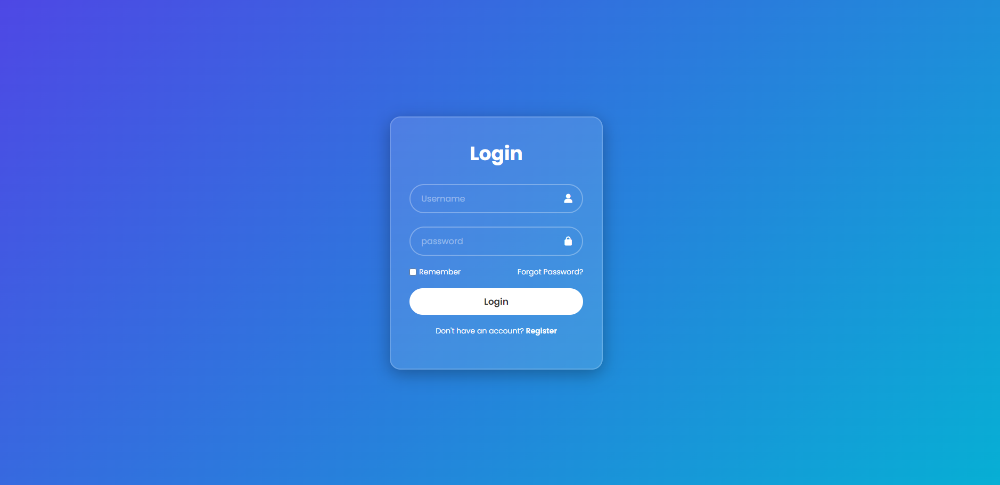
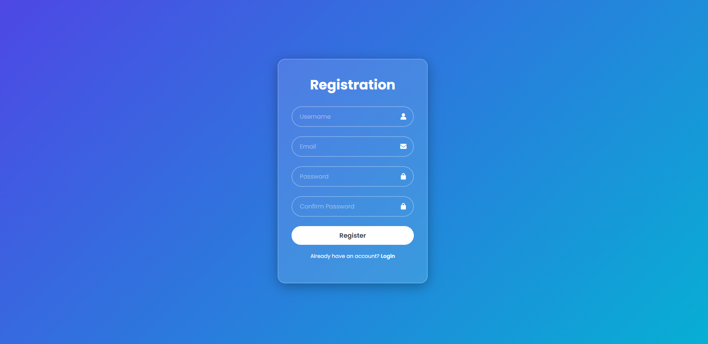
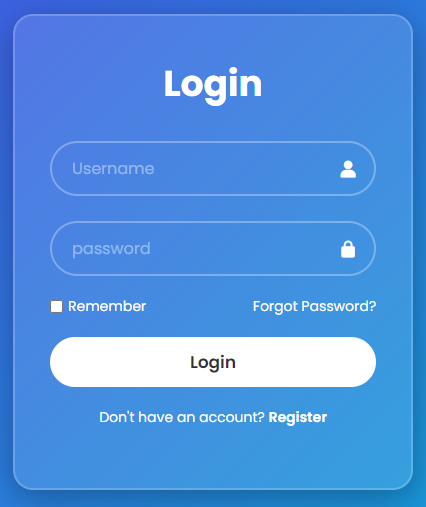
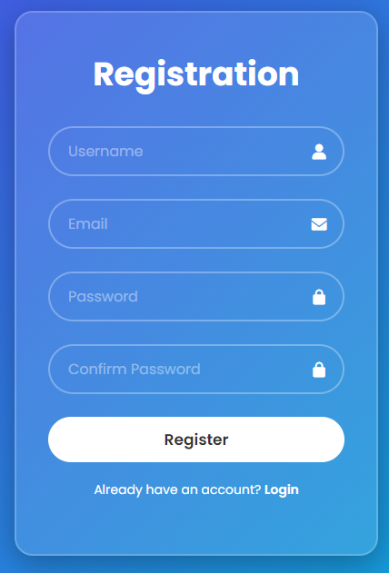

# 🔐 Login & Registration UI

A simple and responsive **Login & Registration User Interface** built using **HTML, CSS, and JavaScript**.

This project demonstrates how to create two forms in a single webpage and switch between the Login and Registration forms using JavaScript.

## ✨ Features

* 🔑 Login form
* 📝 Registration form
* 🔄 Switch between Login and Registration
* 👤 Username input
* 📧 Email input
* 🔒 Password and Confirm Password fields
* ☑️ Remember Me checkbox
* ❓ Forgot Password link
* 🎨 Modern gradient UI
* 💎 Glassmorphism-style container
* 📱 Responsive design
* ⚡ Boxicons for input icons
* 🌐 Google Poppins font

## 🛠️ Technologies Used

* **HTML5** – Page structure
* **CSS3** – Styling, layout, gradient and responsive design
* **JavaScript** – Login/Registration form switching
* **Boxicons** – User interface icons
* **Google Fonts** – Poppins typography

## 📂 Project Structure

```text
Login-Register/
│
├── index.html
├── stylesheet.css
├── script.js
└── README.md
```

## 🖥️ Preview

### Login Page

Add your screenshot here:





### Registration Pag




> Create an `images` folder inside your project and place your screenshots there.

## 🎨 UI Design

The interface uses a modern visual style with:

* Purple-to-cyan gradient background
* Transparent glass-effect card
* Rounded input fields
* White typography
* Smooth hover effects
* Minimal and clean layout

## ⚙️ How It Works

The project contains two forms:

```text
Login Form
     │
     │ Click "Register"
     ▼
Registration Form
     │
     │ Click "Login"
     ▼
Login Form
```

JavaScript controls which form is visible.

```javascript
function showRegistrationForm(event) {
    event.preventDefault();

    document.getElementById("login-form").style.display = "none";
    document.getElementById("register-form").style.display = "block";
}
```

The Login link performs the opposite operation.

## 🚀 How to Run

### 1. Clone the repository

```bash
git clone https://github.com/YOUR-USERNAME/Login-Register.git
```

### 2. Open the project

Navigate to the project folder:

```bash
cd Login-Register
```

### 3. Run

Open:

```text
index.html
```

in your web browser.

You can also use **VS Code Live Server** for easier development.

## 📸 Screenshots

You can add screenshots like this:


## Screenshots






## 📚 What I Learned

Through this project, I practiced:

* Structuring forms with HTML
* Creating modern interfaces with CSS
* Using CSS Flexbox
* Creating responsive layouts
* Using CSS pseudo-classes such as `:hover` and `:focus`
* Connecting JavaScript with HTML elements
* Manipulating the DOM
* Showing and hiding elements with JavaScript
* Using external icon libraries
* Organizing a frontend project into separate files

## 🔮 Future Improvements

Possible improvements for future versions:

* [ ] Add password visibility toggle
* [ ] Add form validation
* [ ] Add password strength indicator
* [ ] Add confirm-password validation
* [ ] Add real authentication
* [ ] Connect to a backend
* [ ] Store users in a database
* [ ] Add Forgot Password functionality
* [ ] Add success/error messages
* [ ] Add animations between Login and Registration
* [ ] Add dark/light mode

## 👨‍💻 Author

**Nadeesha Malshan**

Computer Science Undergraduate | Aspiring AI Software Engineer | Full-Stack Developer

### Connect With Me

* GitHub: [@MalshanDev](https://github.com/MalshanDev)
* LinkedIn: www.linkedin.com/in/nadeesha-malshan-1588-nmk

---

⭐ If you found this project useful, consider giving it a star!
